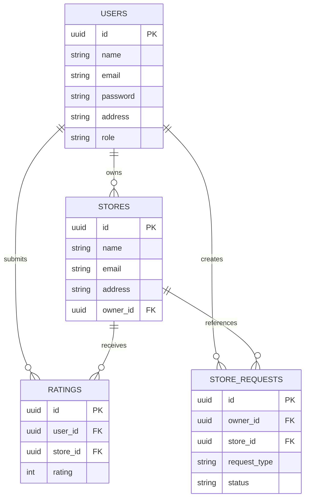

# ⭐ RateStore

A full-stack Store Rating & Management Platform built using **React.js**, **Node.js**, **Express.js**, and **PostgreSQL**.

RateStore enables customers to discover and review stores, store owners to monitor ratings and manage their stores, and administrators to oversee the entire platform through a secure Role-Based Access Control (RBAC) system.

---

## 🚀 Live Features

### 👨‍💼 Administrator

* Dashboard with platform statistics
* View total users, stores, and ratings
* Manage users
* Add new users
* Delete users
* Search users by name, email, and address
* Filter users by role
* Manage stores
* View store reviews
* Delete stores
* Review and approve store requests
* Change password

---

### 🏪 Store Owner

* Dedicated analytics dashboard
* View all owned stores
* Monitor average ratings
* View rating distribution breakdown
* Review customer feedback
* Edit store information
* Edit profile
* Change password
* Request new store creation
* Request store updates
* Request store deletion

---

### 👤 Normal User

* Self registration
* Secure login
* Browse stores
* Search stores by name
* Search stores by address
* Submit ratings (1–5 stars)
* Update existing ratings
* View community reviews
* Change password

---

## ✨ Key Highlights

✅ Role-Based Access Control (RBAC)

✅ JWT Authentication

✅ bcrypt Password Hashing

✅ PostgreSQL Relational Database

✅ Store Rating System

✅ Community Reviews

✅ Store Analytics Dashboard

✅ Store Request Approval Workflow

✅ Search & Filtering

✅ Responsive UI

✅ Protected Routes

✅ Input Validation & Sanitization

---

## 🛠 Tech Stack

| Layer             | Technology           |
| ----------------- | -------------------- |
| Frontend          | React.js             |
| Backend           | Node.js + Express.js |
| Database          | PostgreSQL           |
| Authentication    | JWT                  |
| Password Security | bcrypt               |
| Validation        | express-validator    |
| State Management  | Context API          |
| Styling           | Custom CSS           |
| Fonts             | DM Sans, Syne        |

---

## 🏗 System Architecture

```text
React Frontend
      │
      ▼
Express REST API
      │
      ▼
PostgreSQL Database
```

### Frontend

* React SPA (Single Page Application)
* Context API
* Protected Routes
* Reusable Components
* Role-based Navigation

### Backend

* Express.js REST API
* JWT Middleware
* Role-based Authorization
* Validation Middleware
* PostgreSQL Integration

### Security

* Password hashing using bcrypt (12 rounds)
* JWT tokens expire after 24 hours
* Input validation and sanitization
* Parameterized SQL queries
* Protected API routes

---

## 📊 Database Schema

### Users

| Field    | Type                       |
| -------- | -------------------------- |
| id       | UUID                       |
| name     | String                     |
| email    | String                     |
| password | Hashed Password            |
| address  | Text                       |
| role     | admin / user / store_owner |

### Stores

| Field    | Type        |
| -------- | ----------- |
| id       | UUID        |
| name     | String      |
| email    | String      |
| address  | Text        |
| owner_id | Foreign Key |

### Ratings

| Field    | Type          |
| -------- | ------------- |
| id       | UUID          |
| user_id  | Foreign Key   |
| store_id | Foreign Key   |
| rating   | Integer (1–5) |

### Store Requests

| Field        | Type                          |
| ------------ | ----------------------------- |
| id           | UUID                          |
| owner_id     | Foreign Key                   |
| store_id     | Foreign Key                   |
| request_type | Create / Edit / Delete        |
| note         | Text                          |
| status       | Pending / Approved / Rejected |

---

## 📈 Entity Relationship Diagram



---

## 🔐 Demo Credentials

### Administrator

| Email                                             | Password  |
| ------------------------------------------------- | --------- |
| [admin@ratestore.com](mailto:admin@ratestore.com) | Admin@123 |

---

### Store Owners

All store owners use:

```text
Password: Ratestore@1
```

| Name                     | Email                                                               |
| ------------------------ | ------------------------------------------------------------------- |
| Ramesh Kumar Agarwal     | [ramesh.agarwal@ratestore.com](mailto:ramesh.agarwal@ratestore.com) |
| Sunita Devi Sharma       | [sunita.sharma@ratestore.com](mailto:sunita.sharma@ratestore.com)   |
| Vikram Singh Rajput      | [vikram.rajput@ratestore.com](mailto:vikram.rajput@ratestore.com)   |
| Priya Nair Krishnamurthy | [priya.nair@ratestore.com](mailto:priya.nair@ratestore.com)         |
| Deepak Mohan Verma       | [deepak.verma@ratestore.com](mailto:deepak.verma@ratestore.com)     |
| Anita Suresh Pillai      | [anita.pillai@ratestore.com](mailto:anita.pillai@ratestore.com)     |

---

### Normal Users

All users use:

```text
Password: Ratestore@1
```

Examples:

| Name                | Email                                                   |
| ------------------- | ------------------------------------------------------- |
| Rahul Pratap Singh  | [rahul.singh@gmail.com](mailto:rahul.singh@gmail.com)   |
| Anjali Kumari Gupta | [anjali.gupta@gmail.com](mailto:anjali.gupta@gmail.com) |
| Amit Suresh Patel   | [amit.patel@gmail.com](mailto:amit.patel@gmail.com)     |
| Pooja Rajesh Mehta  | [pooja.mehta@gmail.com](mailto:pooja.mehta@gmail.com)   |
| Sanjay Balram Yadav | [sanjay.yadav@gmail.com](mailto:sanjay.yadav@gmail.com) |

---

## ⚙️ Installation

### Clone Repository

```bash
git clone https://github.com/Gaurav27005/Store-Rating.git
cd Store-Rating
```

---

## Backend Setup

```bash
cd backend
npm install
```

Create `.env`

```env
DATABASE_URL=your_postgresql_connection_string
JWT_SECRET=your_secret_key
PORT=5000
FRONTEND_URL=http://localhost:3000
```

Run backend:

```bash
npm start
```

---

## Frontend Setup

```bash
cd frontend
npm install
```

Create `.env`

```env
REACT_APP_API_URL=http://localhost:5000
```

Run frontend:

```bash
npm start
```

---

## 🌱 Seed Database

After starting the backend once:

```bash
cd backend
node seed.js
```

This automatically creates:

* 1 Administrator
* 6 Store Owners
* 15 Users
* 10 Indian Stores
* 75 Ratings

---

## 📡 API Endpoints

### Authentication

```http
POST /api/auth/login
POST /api/auth/register
PUT  /api/auth/password
```

### Admin

```http
GET    /api/admin/dashboard
GET    /api/admin/users
POST   /api/admin/users
GET    /api/admin/stores
POST   /api/admin/stores
```

### Stores

```http
GET  /api/stores
POST /api/stores/:id/rate
PUT  /api/stores/:id/rate
```

### Owner

```http
GET /api/owner/dashboard
```

---

## 📸 Screenshots

### Authentication

* Login Page
* Registration Page

### User Dashboard

* Browse Stores
* Submit Review
* Community Reviews

### Store Owner Dashboard

* Store Analytics
* Rating Breakdown
* Customer Reviews
* Store Requests
* Edit Profile

### Admin Dashboard

* Dashboard Overview
* User Management
* Store Management
* Store Request Approval

> Add screenshots inside `/screenshots` folder and update image paths.

---

## 🚧 Challenges Faced & Solutions

### Preventing Multiple Ratings

**Problem:** Users could potentially submit multiple ratings for the same store.

**Solution:** Added a database-level uniqueness constraint on `(store_id, user_id)` to enforce one rating per user per store.

---

### Role-Based Security

**Problem:** Restricting access to administrator and owner pages.

**Solution:** Implemented JWT authentication and React protected routes with role-based authorization.

---

### Store Approval Workflow

**Problem:** Allowing owners to create/edit/delete stores without giving direct database access.

**Solution:** Implemented a request approval system where administrators review and approve store modification requests.

---

## 🔮 Future Enhancements

* Email Verification
* Forgot Password
* Rating Trend Charts
* Notifications System
* Docker Support
* CI/CD Pipeline
* Unit Testing
* Integration Testing
* Audit Logs

---

## 👨‍💻 Author

**Gaurav Thorat**

GitHub: https://github.com/Gaurav27005

---

## 📄 License

This project was developed for educational purposes and internship assessment.
